  

 

  

## 📖 Deskripsi Umum

**Mind Floox** adalah platform pembelajaran daring (LMS) berbasis web yang dirancang untuk memfasilitasi sertifikasi kompetensi jangka pendek (*microcredential*) bagi mahasiswa. Sistem ini mengintegrasikan empat aktor utama: **Super Admin**, **Admin Microcredential**, **Instruktur**, dan **Peserta**.

<table>
<tr>
<td width="50%" valign="top">

**Proses bisnis yang dicakup:**
- 📝 Pendaftaran dan verifikasi peserta program
- 📚 Pengelolaan kursus 14 minggu
- ✅ Evaluasi melalui tugas dan kuis

</td>
<td width="50%" valign="top">

**Nilai tambah sistem:**
- 📊 Pelacakan progres belajar secara transparan
- 🎓 Penerbitan sertifikat digital otomatis
- 🔐 Manajemen akses berbasis role

</td>
</tr>
</table>

Dibangun menggunakan **Laravel** (pola arsitektur MVC), **Tailwind CSS**, dan **Alpine.js**, aplikasi ini menghasilkan sistem pembelajaran yang responsif, aman, dan efisien.

 

<b>🎯 Latar Belakang</b> (klik untuk buka)

 

> Mahasiswa membutuhkan perolehan kompetensi spesifik tambahan untuk kesiapan kerja, didukung oleh data riset yang menunjukkan tingginya urgensi *microcredential* bagi karier mahasiswa. Platform yang ada saat ini belum terintegrasi secara khusus dengan institusi pendidikan serta belum menyediakan sistem terpusat untuk pendaftaran, penilaian, dan pengakuan kompetensi secara resmi.

<b>🚀 Tujuan</b> (klik untuk buka)

 

> Membangun platform pembelajaran daring guna memudahkan pengelolaan pendaftaran, materi, evaluasi, hingga penerbitan sertifikat kompetensi mahasiswa, serta menyediakan validasi kelulusan otomatis demi menjamin keabsahan sertifikat digital.

## 👥 Aktor & Fitur Utama

| Aktor | Fitur Utama |
|:---:|---|
| 🛡️ **Super Admin** | Mengelola jenis microcredential, akun Admin Microcredential, data profil Instruktur, periode pembelajaran, dan program microcredential |
| 🧑‍💼 **Admin Microcredential** | Mengelola kursus, menugaskan Instruktur ke kursus, verifikasi pendaftaran Peserta |
| 🧑‍🏫 **Instruktur** | Mengelola materi pembelajaran, tugas, dan kuis; menilai hasil evaluasi Peserta |
| 🎓 **Peserta** | Mendaftar program, mempelajari materi, mengerjakan tugas/kuis, memantau progres, mengunduh sertifikat, memberikan rating |

 

## 🛠️ Tech Stack

  

 
 
 

## 🔄 Metodologi Pengembangan

Pengembangan aplikasi ini menerapkan **SDLC Model Waterfall**, dipilih karena membutuhkan struktur yang sistematis, dokumentasi matang (SKPPL), serta definisi kebutuhan fitur yang jelas sejak awal untuk meminimalisir kesalahan rancangan sebelum tahap pengodean.

```mermaid
flowchart LR
    A["📋 Planning"] --> B["🔍 Analysis"]
    B --> C["🎨 Design"]
    C --> D["💻 Implementation"]
    D --> E["🧪 Testing & Integration"]
    E --> F["🔧 Maintenance"]

    style A fill:#6C63FF,color:#fff,stroke:#2D2A5E,stroke-width:2px
    style B fill:#5B54E0,color:#fff,stroke:#2D2A5E,stroke-width:2px
    style C fill:#4A45C2,color:#fff,stroke:#2D2A5E,stroke-width:2px
    style D fill:#3A9EA3,color:#fff,stroke:#2D2A5E,stroke-width:2px
    style E fill:#2EC4B6,color:#fff,stroke:#2D2A5E,stroke-width:2px
    style F fill:#2D2A5E,color:#fff,stroke:#6C63FF,stroke-width:2px
```

 

## ✅ Kesimpulan

Aplikasi Microcredential Mind Floox berhasil dirancang sesuai spesifikasi kebutuhan untuk menjadi platform pembelajaran daring yang efisien. Melalui integrasi manajemen multi-role, pelacakan progres belajar yang transparan, serta sistem otomatisasi penerbitan sertifikat digital, aplikasi ini mampu menjawab kebutuhan institusi pendidikan dalam menyelenggarakan program penguatan kompetensi mahasiswa secara terorganisasi dan akuntabel.

Teknologi Rekayasa Perangkat Lunak — Politeknik Negeri Batam

