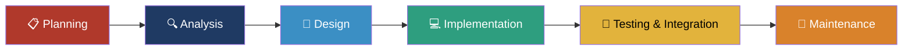

 

 

## 📖 Deskripsi Umum

**Mind Floox** adalah platform pembelajaran daring (LMS) berbasis web yang dirancang untuk memfasilitasi sertifikasi kompetensi jangka pendek (*microcredential*) bagi mahasiswa. Sistem ini mengintegrasikan empat aktor utama: **Super Admin**, **Admin Microcredential**, **Instruktur**, dan **Peserta**.

Proses bisnis yang dicakup meliputi:
- 📝 Pendaftaran dan verifikasi peserta program
- 📚 Pengelolaan kursus 14 minggu
- ✅ Evaluasi melalui tugas dan kuis
- 📊 Pelacakan progres belajar secara transparan
- 🎓 Penerbitan sertifikat digital otomatis

Dibangun menggunakan **Laravel** (pola arsitektur MVC), **Tailwind CSS**, dan **Alpine.js**, aplikasi ini menghasilkan sistem pembelajaran yang responsif, aman, dan efisien.

 

## 🎯 Latar Belakang

> Mahasiswa membutuhkan perolehan kompetensi spesifik tambahan untuk kesiapan kerja, didukung oleh data riset yang menunjukkan tingginya urgensi *microcredential* bagi karier mahasiswa. Platform yang ada saat ini belum terintegrasi secara khusus dengan institusi pendidikan serta belum menyediakan sistem terpusat untuk pendaftaran, penilaian, dan pengakuan kompetensi secara resmi.

## 🚀 Tujuan

> Membangun platform pembelajaran daring guna memudahkan pengelolaan pendaftaran, materi, evaluasi, hingga penerbitan sertifikat kompetensi mahasiswa, serta menyediakan validasi kelulusan otomatis demi menjamin keabsahan sertifikat digital.

 

## 👥 Aktor & Fitur Utama

| Aktor | Fitur Utama |
|:---:|---|
| 🛡️ **Super Admin** | Mengelola jenis microcredential, akun Admin Microcredential, data profil Instruktur, periode pembelajaran, dan program microcredential |
| 🧑‍💼 **Admin Microcredential** | Mengelola kursus, menugaskan Instruktur ke kursus, verifikasi pendaftaran Peserta |
| 🧑‍🏫 **Instruktur** | Mengelola materi pembelajaran, tugas, dan kuis; menilai hasil evaluasi Peserta |
| 🎓 **Peserta** | Mendaftar program, mempelajari materi, mengerjakan tugas/kuis, memantau progres, mengunduh sertifikat, memberikan rating |

 

## 🛠️ Tech Stack

- **Backend:** Laravel (PHP) — pola arsitektur MVC
- **Frontend:** Tailwind CSS v4 + Alpine.js
- **Database:** MySQL / PostgreSQL
- **Metodologi Pengembangan:** SDLC Model Waterfall

 

## 🔄 Metodologi Pengembangan

Pengembangan aplikasi ini menerapkan **SDLC Model Waterfall**, dipilih karena membutuhkan struktur yang sistematis, dokumentasi matang (SKPPL), serta definisi kebutuhan fitur yang jelas sejak awal untuk meminimalisir kesalahan rancangan sebelum tahap pengodean.

 

## ✅ Kesimpulan

Aplikasi Microcredential Mind Floox berhasil dirancang sesuai spesifikasi kebutuhan untuk menjadi platform pembelajaran daring yang efisien. Melalui integrasi manajemen multi-role, pelacakan progres belajar yang transparan, serta sistem otomatisasi penerbitan sertifikat digital, aplikasi ini mampu menjawab kebutuhan institusi pendidikan dalam menyelenggarakan program penguatan kompetensi mahasiswa secara terorganisasi dan akuntabel.

 

## 👨‍💻 Tim Pengembang

Proyek ini dikembangkan oleh mahasiswa Program Studi <b>Teknologi Rekayasa Perangkat Lunak (TRPL)</b>, Politeknik Negeri Batam — Kelompok <b>PBL-214</b>.

| NIM | Nama | Peran |
|:---:|---|:---:|
| 4342501015 | Shabir Khan | Anggota Kelompok |
| 4342501009 | Charoline Feby Riyani | Anggota Kelompok |
| 4342501008 | Arkam Arasid Meliala | Anggota Kelompok |
| 4342501024 | Nadya Nofitri | Anggota Kelompok |
| 4342501012 | Muhammad Fahad Arifin | Anggota Kelompok |
| NIK 1222382 | Cahya Miranto | 🧑‍💼 Manajer Proyek |

 

<i>Teknologi Rekayasa Perangkat Lunak — Politeknik Negeri Batam</i>

